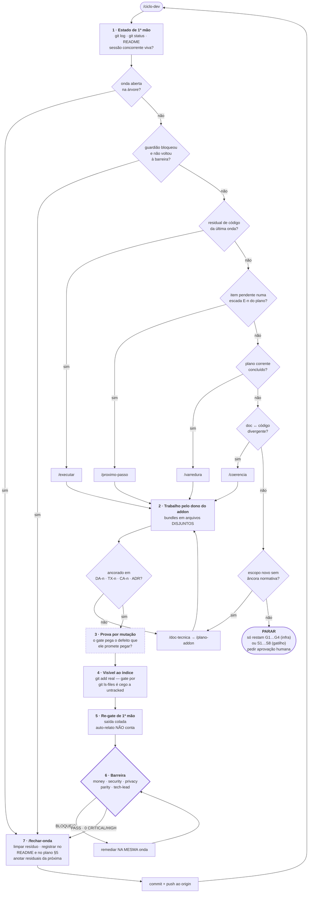

# Guia prático — desenvolvimento em loop no AdServer

Como rodar o ciclo de desenvolvimento deste repositório com agentes, o que
esperar de cada volta, e as regras que separam uma onda que agrega valor de uma
que produz trabalho bonito e falso.

Tudo aqui foi pago com onda. As regras da §5 não são estilo — cada uma existe
porque a sua ausência custou uma varredura inteira.

---

## 1. O que é

Um **deck de 8 prompts + 1 driver**, versionados em `.claude/commands/`, que
transformam o ciclo de desenvolvimento em comandos executáveis. Todos
compartilham um único arquivo de invariantes:
**[`contexto-ancora.md`](contexto-ancora.md)** — estado do projeto, tabela
`addon → dono → gate`, comandos de re-gate, protocolos de mutação, regras de
ancoragem documental.

Mudou um invariante? Edite o contexto-âncora. Vale para os 9 comandos de uma vez.

| Comando | Papel |
|---|---|
| `/ciclo-dev` | **driver** — lê o estado do repo e escolhe o estágio |
| `/plano-projeto` | valida o plano por addon e abre o próximo quando o atual fecha |
| `/doc-tecnica` | documentação nas 5 seções obrigatórias |
| `/plano-addon` | plano de um addon — **inventário de reuso primeiro** |
| `/proximo-passo` | deriva e executa o próximo passo |
| `/executar` | explica → mostra na doc → executa → confirma |
| `/varredura` | busca profunda de erros e falsos-positivos |
| `/coerencia` | nomenclatura, estilo, duplicação, contratos, doc↔código |
| `/fechar-onda` | erros restantes + limpeza + re-gate + guardiões + registro + push |

---

## 2. Rodar

Está no repositório, em `main` — nada a instalar. Digite `/` no Claude Code:

```text
/ciclo-dev              # uma volta; ele decide o estágio
/ciclo-dev varredura    # força um estágio
/loop /ciclo-dev        # loop contínuo, auto-pautado
/loop 30m /ciclo-dev    # loop com intervalo fixo
```

Parar: `Esc`, ou peça para encerrar o loop.

Os comandos também funcionam sozinhos quando você já sabe o que quer —
`/varredura ledger` é muito mais barato que o driver completo.

**Pré-requisitos reais** (medidos nesta máquina): Go 1.26, Node 24, Python 3.12,
**Postgres 16 rodando**. Não precisa de Docker, Redis, ClickHouse nem Redpanda —
o perfil BETA (ADR-0005) existe exatamente para isso:

```bash
make beta-up      # sobe decision + collector nativos contra Postgres
make beta-check   # prova a cadeia: decide → pixel → clique → evento persistido
make beta-down
```

---

## 3. O ciclo completo

Uma volta inteira, do `/ciclo-dev` até o push — e de volta ao começo. O losango
**6** é onde está o valor: a barreira reentra em si mesma até passar.



Duas setas explicam por que o loop não vira esteira: **`6 → remediar → 6`** (a
remediação volta à barreira, nunca se auto-aprova) e **`ANCHOR → /doc-tecnica`**
(código sem âncora normativa não é executado, é documentado primeiro).

### A árvore de decisão, em forma exata

Ele para no primeiro que casar:

| Condição | Estágio |
|---|---|
| Trabalho de onda não fechado na árvore | `/coerencia` → `/fechar-onda` |
| Guardião bloqueou e a remediação não voltou à barreira | `/fechar-onda` (fase 4) |
| Residual de código registrado na última onda | `/executar` |
| Item `próxima/pendente` numa escada `E<n>` do plano | `/proximo-passo` |
| Plano corrente concluído, sem item de código | `/varredura` |
| Doc↔código divergente (ressalva §6 aberta) | `/coerencia` |
| Escopo novo sem âncora normativa | `/doc-tecnica` → `/plano-addon` |
| Plano do §5 encerrado por inteiro | `/plano-projeto` |
| Só restam G1…G4 (infra) ou S1…S8 (gatilho) | **PARAR** e pedir aprovação humana |

---

## 4. Uma volta completa, na prática

O exemplo abaixo é real (onda "perfil BETA") e é o melhor material de treino que
existe, porque mostra o loop funcionando **contra quem o conduz**.

**Medição.** A doc afirmava "código-completo, só falta infra". Subi a pilha:
o motor servia anúncio de verdade, mas todo evento ia para `noopSink`, o
dashboard respondia `PRECONDITION_FAILED` e o frequency cap não era imposto.
Três lacunas de **código**, nenhuma dependente de nuvem.

**Fan-out.** Quatro donos em arquivos disjuntos: telemetria, capping, stats,
comando único. Cada um obrigado a provar o próprio gate por mutação.

**Achados de segundo grau.** Ao consertar o pacing DA-4, **tornei alcançável**
um buraco que dormia: campanha Contract entregando além do volume comprado. Só
era inofensivo porque o contador nunca saía de zero.

**Barreira.** Cinco guardiões sobre o diff. Três bloquearam. Quatro dos defeitos
eram meus — incluindo o `beta-check` **tautológico**, que era justamente o gate
que eu vinha citando como prova de que o trabalho funcionava. O tech-lead
revogou o `INSERT` da role e o gate continuou dizendo PASS.

**Remediação e reversão.** O filtro de meta atingida saiu da árvore por decisão
do tech-lead: com o sinal de impressão ainda não assinado, ligá-lo transformaria
"forjar pixel empurra ranking" em "forjar pixel tira campanha paga do ar".

Lição da volta inteira: **o valor não estava no código entregue, estava na
barreira.**

---

## 5. As dez regras

1. **Meça de 1ª mão. A doc mente.** Comece toda onda rodando a coisa, não lendo
   sobre ela. Duas vezes neste repo o "código-completo com gates verdes" escondia
   funcionalidade que nunca fora ligada (calibração isotônica; contagens
   entregues).
2. **Gate verde não é prova de gate real.** Só a mutação que ele *deveria* pegar
   prova. Todo achado carrega `run_verified=true` com comando e saída antes/depois.

   ```mermaid
   flowchart LR
       A["gate escrito<br/>e verde"] --> B["cp backup"]
       B --> C["mutar EXATAMENTE o defeito<br/>que o gate promete pegar"]
       C --> D{"ficou<br/>VERMELHO?"}
       D -->|não| E["<b>gate tautológico</b><br/>ele não impõe nada<br/>reescrever"]
       E --> A
       D -->|sim| F["mv restaurar<br/><b>nunca git checkout</b>"]
       F --> G(["gate PROVADO"])
       style E stroke-width:3px
   ```

   O ramo da esquerda não é hipotético: foi assim que o `beta-check` desta onda
   se revelou tautológico — com o `INSERT` revogado, a cadeia respondia e o gate
   dizia PASS medindo linhas de execuções anteriores.
3. **Auto-relato de subagente ≠ re-gate.** Rode você mesmo e cole a saída. Um
   agente relatou corretamente que o cap disparava; outro relatou um E2E que só
   passava porque media linhas de execuções anteriores.
4. **Todo sweep gera os próprios falsos-positivos.** Re-audite o diff do sweep.
   Em quatro ondas seguidas a barreira pegou defeito criado pela própria onda.
5. **Corrija a FORMA, não a instância.** Lista hardcoded → glob derivado com
   sentinela. Denylist de nomes → default-deny sobre o tipo. Cópia de enum →
   derivação com exaustividade em compile-time. Corrigir só a instância garante
   a reincidência: aconteceu 3× com a mesma classe.
6. **Escopo é default-deny.** Escopar gate por nome de arquivo ou diretório
   "financeiro" foi a classe dominante de falso-positivo em três ondas seguidas.
   Escope ao **token/statement/linha lógica** — nunca substring no corpus, nunca
   exclusão por-linha-inteira.
7. **Arquivo untracked é invisível.** Os guards selecionam por `git ls-files`.
   Torne o código novo visível ao índice (`git add` real) **antes** de alegar
   cobertura — senão o `make no-float` verde não cobriu nada do que você escreveu.
8. **Protocolo de mutação: `cp` backup → mutar → rodar → `mv` restaurar.**
   **Nunca** `git add -N` + `git checkout --`: o `-N` grava blob de zero bytes e
   o checkout **apaga** o arquivo.
9. **Não interrompa um sweep no meio.** `TaskStop` entre "mutar" e "restaurar"
   deixa sonda de mutação viva no código. Se precisar parar, varra
   `git status` e `make verify` depois.
10. **Nada é marcado como concluído sem gate que rode hoje.** Subrepresentar é
    aceitável; superrepresentar não. Vale para `CA-n`, para etapa de plano e para
    qualquer frase de README.

Corolário que vale por si: **silêncio é reprovação.** Em gate de paridade ou
cutover, ausência de divergência medida nunca é aprovação por omissão.

---

## 6. A barreira de guardiões

Condição de merge. Cinco leitores sobre o **diff completo**, não sobre o
auto-relato de quem escreveu:

| Guardião | Mandato |
|---|---|
| `money-ledger-guardian` | TX-2 (float em dinheiro), DA-7 (faturável só contra Iceberg), CA-6, DA-10 |
| `security-reviewer` | TX-3/CA-1 (isolamento por tenant), ACL, segredos, SSRF/CSRF |
| `privacy-compliance-auditor` | TX-5/DA-11 (PII, IP bruto), retenção, C2PA |
| `parity-golden-test-guardian` | CA-1…CA-9, semântica da cascata, shadow/dual-run |
| `tech-lead-architect` | ADRs, escopo, doc↔código, sequenciamento |

**PASS sem CRITICAL/HIGH.** Bloqueio é remediado na mesma onda, e a remediação
**volta à barreira** — não se auto-aprova.

Chame-os com o diff já pronto e diga explicitamente o que é seu e o que é de
outra sessão. Peça adjudicação onde você deliberadamente não decidiu: foi assim
que o teto de meta virou decisão fundamentada em vez de mudança silenciosa de
semântica.

---

## 7. Higiene operacional

**Uma sessão por working tree.** Duas sessões no mesmo repo causaram colisão
real: um adapter passou a depender de arquivo que só existia na árvore da outra.
Antes de editar:

```bash
git status --porcelain
ps aux | grep -i claude
git diff > /tmp/backup-antes.patch     # sempre
```

**Bancos de scratch.** Agentes criam bancos de teste. Use nome próprio, nunca
recrie o banco de dev de outra pessoa, e limpe ao fim:

```bash
psql -At -c "select datname from pg_database where datname like 'adserver%'" postgres
```

**Portas.** Confira antes de subir qualquer coisa. Nunca mate processo alheio:

```bash
ss -ltnp | grep -E ':(3001|3005|8080|8081)'
```

**Resíduo.** Ao fechar, varra sonda de mutação, backup, arquivo temporário,
import não usado, contagem em prosa desatualizada, e artefato remoto (branch,
tag, workflow-run órfão).

---

## 8. Calibrar custo

A onda descrita na §4 consumiu cerca de **2 milhões de tokens em 10 subagentes**.
Isso é apropriado para uma onda de varredura ampla; é desperdício para conferir
uma função.

| Trabalho | Chamada |
|---|---|
| Conferir uma função, um arquivo | direto, sem agente |
| Um addon, escopo conhecido | `/executar` ou `/varredura <família>` |
| Uma família de gate inteira | `/varredura` com escopo |
| Onda ampla, multi-addon | `/ciclo-dev` (fan-out por dono) |
| Loop desacompanhado | `/loop /ciclo-dev` — **só com a árvore limpa** |

Regra prática: se você consegue nomear os arquivos, não precisa de fan-out.

---

## 9. Quando quebra

**Agente morre no meio** (erro de API acontece). O trabalho no disco sobrevive —
mas a *verificação* dele não. Assuma a auditoria você mesmo:

```bash
git status --porcelain          # o que ele deixou
go build ./... && go vet ./...  # compila?
find . -name "*.bak" -o -name "*.orig" | grep -v node_modules
make verify
```

Nesta sessão um agente morreu exatamente no passo "verificar grants" — e os
grants estavam de fato incompletos. O E2E só falhou porque eu rodei de 1ª mão.

**Gate suspeito.** Mute-o e veja se fica vermelho. Se não ficar, ele não existe.

**Agente contradiz outro.** Vale quem executou. Peça o comando e a saída; um
relato sem `run_verified` não empata com um com.

---

## 10. Checklist de fecho

```text
[ ] Re-gate de 1ª mão VERDE, saída colada
      make verify · go build/vet/test/lint · parity-golden
      ml-test · data-validate · db-lint · copilot-test
      bff-ci · web-ci · web-a11y · platform-validate
      db-check-migration-pairing · db-check-schema-list
[ ] Código novo visível ao índice ANTES de alegar cobertura
[ ] Barreira dos 5 guardiões PASS, 0 CRITICAL/HIGH
[ ] Remediações voltaram à barreira
[ ] Registro honesto: blockquote no README + parágrafo no plano §5
      (achados, lições NOVAS, residuais para a próxima)
[ ] Resíduo limpo: sonda, backup, temporário, banco de scratch
[ ] git status limpo do que não é entrega
[ ] Commit + push ao origin, mensagem no formato das anteriores
```

---

## 11. Antipadrões

- **Chamar `/executar` e nunca `/fechar-onda`.** Você fica com o custo do loop e
  sem a barreira, que é onde está o valor.
- **Aceitar o relatório do agente como verificação.** Ele é insumo, não veredito.
- **Escrever número em prosa.** Contagem de teste apodrece entre a edição e o
  commit. Derive do comando na hora, ou não escreva.
- **Marcar `[x]` para "ficar verde".** A legenda de 4 estados existe justamente
  para permitir `[~]` com a lacuna nomeada.
- **Consertar a doc sem limpar o snippet inteiro.** O exemplo vizinho quebrado
  engana igual.
- **Rodar loop desacompanhado com árvore suja.** O driver vai rotear para
  "fechar onda" e esbarrar em decisões que são suas.
- **Deixar o gate afirmar mais do que verifica.** Comentário que promete garantia
  inexistente é a mesma classe do `//nolint` decorativo — três vezes nesta onda
  uma afirmação sobre gate se revelou mais forte que o gate.
